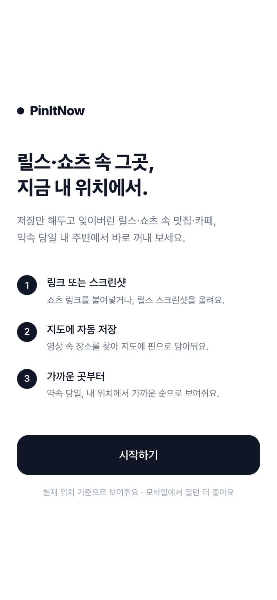
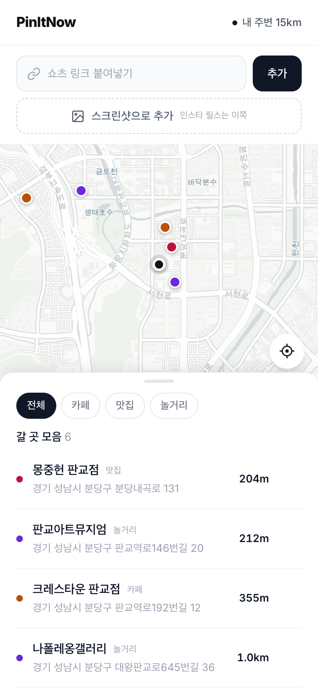

# PinItNow

릴스·쇼츠로 저장해 둔 장소를 지도에 모아, 현재 위치에서 가까운 순으로 보여주는 서비스

**배포 링크: https://pin-it-now-alpha.vercel.app**

| 랜딩 | 지도 · 거리순 목록 |
|---|---|
|  |  |

## 개요

SNS에 저장한 장소는 시간순 목록으로만 쌓여, 정작 필요한 순간에 꺼내 보기 어렵다.
PinItNow는 저장한 릴스·쇼츠에서 장소 정보를 자동으로 추출해 지도에 정리하고,
현재 위치를 기준으로 가까운 곳부터 보여준다.

가설 검증을 위한 프로토타입으로, 데이터는 브라우저에만 저장된다.

## 주요 기능

| 기능 | 설명 |
|---|---|
| 링크로 추가 | 유튜브 쇼츠 링크를 입력하면 캡션을 분석해 장소를 자동 추출 |
| 스크린샷으로 추가 | 릴스 화면을 캡처해 업로드하면 화면 자막에서 상호명을 인식 |
| 거리순 정렬 | 저장한 장소를 현재 위치 기준 가까운 순으로 표시 |
| 지도 시각화 | 카페·맛집·놀거리를 카테고리별 색상 핀으로 구분 |
| 직접 검색 | 자동 추출 실패 시 장소명 검색으로 추가 |
| 외부 지도 연동 | 저장한 장소를 네이버 지도·카카오맵에서 바로 열기 |

## 동작 방식

```
릴스·쇼츠 링크  ─┐
                 ├─→  Gemini  ─→  장소명·카테고리 추출  ─→  Kakao Local API  ─→  지도에 핀 추가
릴스 스크린샷   ─┘   (텍스트/비전)                              (좌표·주소 확정)
                          │
                          └─ 추출 실패 시 → 장소 직접 검색
```

1. 링크 입력 시 캡션을 수집하고, 스크린샷 업로드 시 화면 자막을 인식한다.
2. Gemini가 텍스트 또는 이미지에서 상호명과 카테고리를 추출한다.
3. Kakao Local API로 좌표와 도로명 주소를 확정해 지도에 표시한다.
4. 추출에 실패하면 장소 직접 검색 화면으로 전환된다.
5. 저장된 장소는 브라우저(localStorage)에 보관되며, 현재 위치 기준으로 정렬된다.

> **인스타그램 릴스는 스크린샷 업로드를 권장한다.**
> 인스타그램은 비로그인 서버 요청을 차단하므로 링크 기반 캡션 수집이 제한적이다.
> 또한 릴스는 캡션보다 화면 자막에 상호명이 노출되는 경우가 많아 인식률이 더 높다.

## 기술 스택

| 영역 | 사용 기술 |
|---|---|
| 프레임워크 | Next.js 16 (App Router), React 19 |
| 스타일 | Tailwind CSS v4 |
| 지도 | Leaflet, CARTO 타일 |
| 장소 추출 | Google Gemini (텍스트 · 비전) |
| 장소 검색 | Kakao Local API |
| 데이터 저장 | localStorage |
| 배포 | Vercel |

## 프로젝트 구조

```
app/
  page.js                      랜딩 페이지
  app/page.js                  메인 화면 (지도 · 목록 · 장소 추가)
  layout.js                    메타데이터, 모바일 뷰포트 설정
  globals.css                  지도 핀 스타일
  api/
    _lib/place-pipeline.js     Gemini 추출 + Kakao 좌표 확정 공용 파이프라인
    extract/route.js           링크 기반 장소 추출
    extract-image/route.js     스크린샷 기반 장소 추출
    search/route.js            장소명 직접 검색
```

링크 경로와 스크린샷 경로는 프롬프트만 다르며, 좌표 확정과 응답 규약은 `place-pipeline.js`에서 공유한다.
